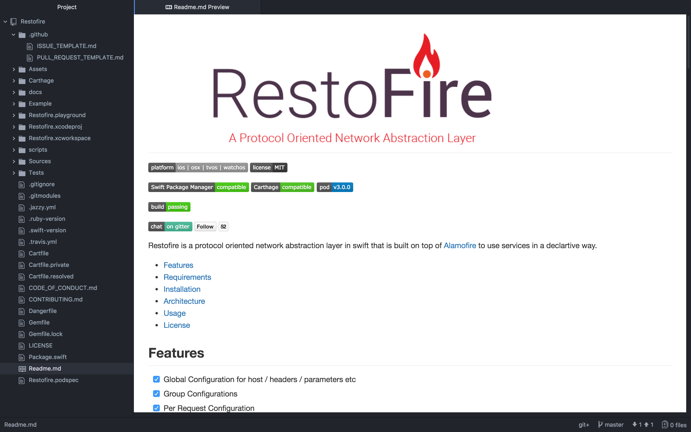

# Framework Template

A template for new Framework project.

## What's in the template?

- Deployment Targets - iOS 8.0 / Mac OS X 10.10 / tvOS 9.0 / watchOS 2.0
- Xcode 9.0
- Swift 4.0
- Dependency Managers - CocoaPods / Carthage / Swift Package Manager
- Readme
- Dangerfile / Gemfile / Jazzy
- Github Templates (CODE_OF_CONDUCT, CONTRIBUTING, ISSUE_TEMPLATE, PULL_REQUEST_TEMPLATE)
- TravisCI
- MIT LICENSE
- Testing Dependencies - Quick and Nimble

## Usage

1. [Install carthage][carthage] (`brew install carthage` on
   macOS).
2. [Install cookiecutter][cookiecutter] (`brew install cookiecutter` on
   macOS).
3. Run `cookiecutter https://github.com/JetpackSwift/FrameworkTemplate`

[carthage]: https://github.com/Carthage/Carthage
[cookiecutter]: http://cookiecutter.readthedocs.org/en/latest/installation.html

For future runs you can shorten the command to `cookiecutter FrameworkTemplate`.
However, if you want to use the most recent template you should still run the full command above.

## Built With FrameworkTemplate

- [Restofire](http://github.com/Restofire/Restofire)

## Credits

*Some of the ideas and wording for the statements above were based on work by the [Alamofire](https://github.com/Alamofire/Alamofire) and [ReactiveCocoa](https://github.com/ReactiveCocoa/ReactiveCocoa) communities. We commend them for their efforts.*

## Contributing

Issues and pull requests are welcome!

## Author

Rahul Katariya [@rahulkatariya91](https://twitter.com/rahulkatariya91)

## License

FrameworkTemplate is released under the MIT license. See [LICENSE](https://github.com/cookiecutter-swift/Framework/blob/master/LICENSE) for details.
